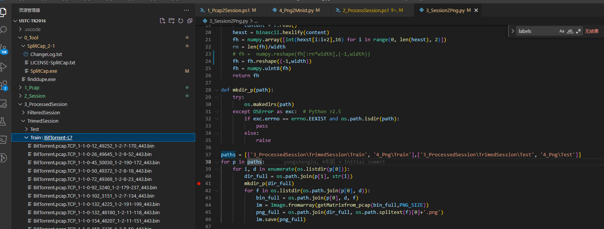

# USTC-TK2016

This repository is a toolkit called "USTC-TK2016", which is used to parse network traffic (`.pcap` file). Besides, the dataset is "USTC-TFC2016".

* The [`master`](https://github.com/yungshenglu/USTC-TK2016/tree/master) branch can only run on Windows environment.
* The [`ubuntu`](https://github.com/yungshenglu/USTC-TK2016/tree/ubuntu) branch can run on Ubuntu Linux 16.04 LTS environment.

> **NOTICE:** This repository credits to [echowei/DeepTraffic](https://github.com/echowei/DeepTraffic)

---
## Installation

1. Clone this repository on your machine
    ```bash
    # Clone the repository on "master" branch
    $ git clone -b master https://github.com/yungshenglu/USTC-TK2016
    ```
2. Install the required packages via the following command
    ```bash
    # Run the command at the root of the repository
    $ pip3 install -r requirements.txt
    ```
    * The requried packages are listed as follow:
        * [`numpy 1.16.4`](https://pypi.org/project/numpy/)
        * [`PIL 1.1.6`](https://pypi.org/project/PIL/)

---
## Execution

> **NOTICE:** You are on the `master` branch now!

1. Download the traffic dataset **USTC-TFC2016** and put it into the directory [`1_Pcap\`](1_Pcap/)
    * You can download the traffic dataset **USTC-TFC2016** from my another [repository](https://github.com/yungshenglu/USTC-TFC2016).
2. Open the PowerShell and run `1_Pcap2Session.ps1` (take a few minutes)
    * To split the PCAP file by each **session**, please make sure the line 10 and 14 in `1_Pcap2Session.ps1` is uncommented and make line 11 and 15 is in comment.
    * To split the PCAp file by each **flow**, please make sure the line 11 and 15 in `1_Pcap2Session.ps1` is uncommented and make line 10 and 14 is in comment.
    * Run [`1_Pcap2Session.ps1`](1_Pcap2Session.ps1)
        ```bash
        # Make sure your current directory is correct
        PS> .\1_Pcap2Session.ps1
        ```
    * If succeed, you will see the following files (folders) in folder [`2_Session\`](2_Session/)
        * `AllLayers\`
        * `L7\`
3. Run [`2_ProcessSession.ps1`](2_ProcessSession.ps1) (take a few minutes)
    ```bash
    # Make sure your current directory is correct
    PS> .\2_ProcessSession.ps1
    ```
    * If succeed, you will see the following files (folders) in folder [`3_ProcessedSession\`](3_ProcessedSession/)
        * `FilteredSession\` - Get the top 60000 large PCAP files
        * `TrimedSession\` - Trim the filtered PCAP files into size 784 bytes (28 x 28) and append `0x00` if the PCAP file is shorter than 784 bytes
        * The files in subdirectory `Test\` and `Train\` is random picked from dataset.
4. Run [`3_Session2Png.py`](3_Session2Png.py) (take a few minutes)
    ```bash
    # Make sure your current directory is correct
    PS> python3 3_Session2png.py
    ```
    * If succeed, you will see the following files (folders) in folder [`4_Png\`](4_Png/)
        * `Test\` - For testing
        * `Train\` - For training
5. Run [`4_Png2Mnist.py`](4_Png2Mnist.py) (take a few minutes)
    ```bash
    # Make sure your current directory is correct
    PS> python3 4_Png2Mnist.py
    ```
    * If succeed, you will see the the training datasets in folder [`5_Mnist\`](5_Mnist/)
        * `train-images-idx1-ubyte`
        * `train-images-idx3-ubyte`
        * `train-images-idx1-ubyte.gz`
        * `train-images-idx3-ubyte.gz`

---
## Contributor

> **NOTICE:** You can follow the contributing process [CONTRIBUTING.md](CONTRIBUTING.md) to join me. I am very welcome any issue!

* Author
    * [Wei Wang](https://github.com/echowei) - ww8137@mail.ustc.edu.cn
* Contributor
    * [David Lu](https://github.com/yungshenglu)

---
## License

[Mozilla Public License Version 2.0](LICENSE)


## 数据集标签说明

39行for循环的`i`作为标签id，一个index对应`3_ProcessedSession\TrimedSession\Train`目录中的一个文件夹



